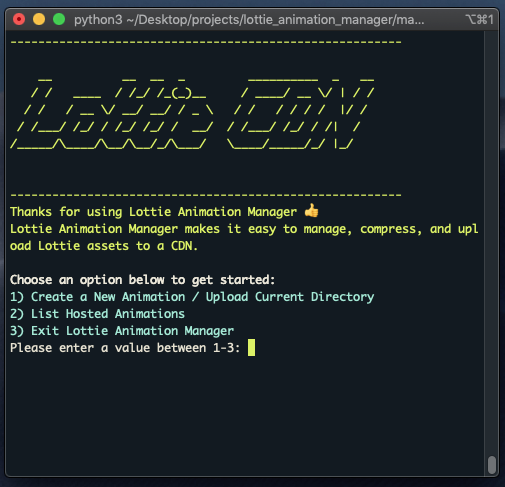
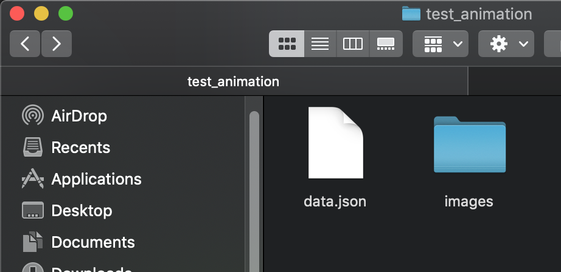
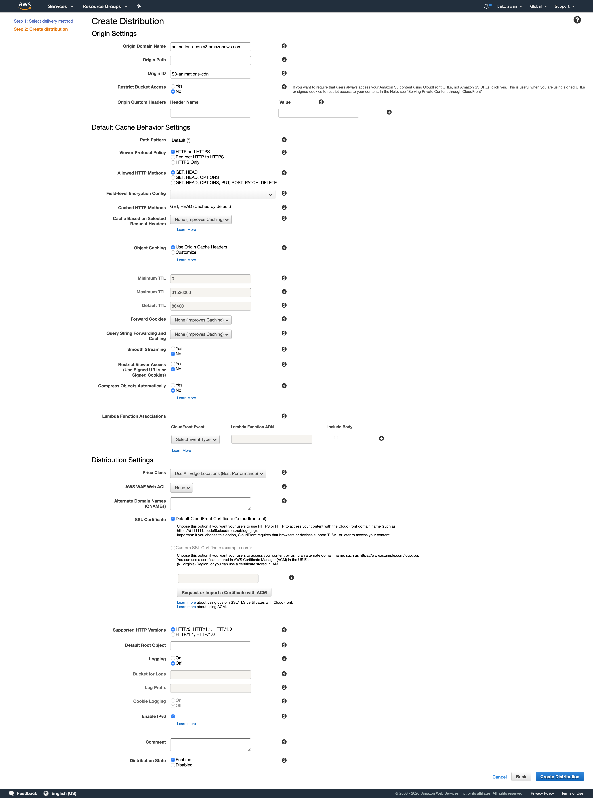
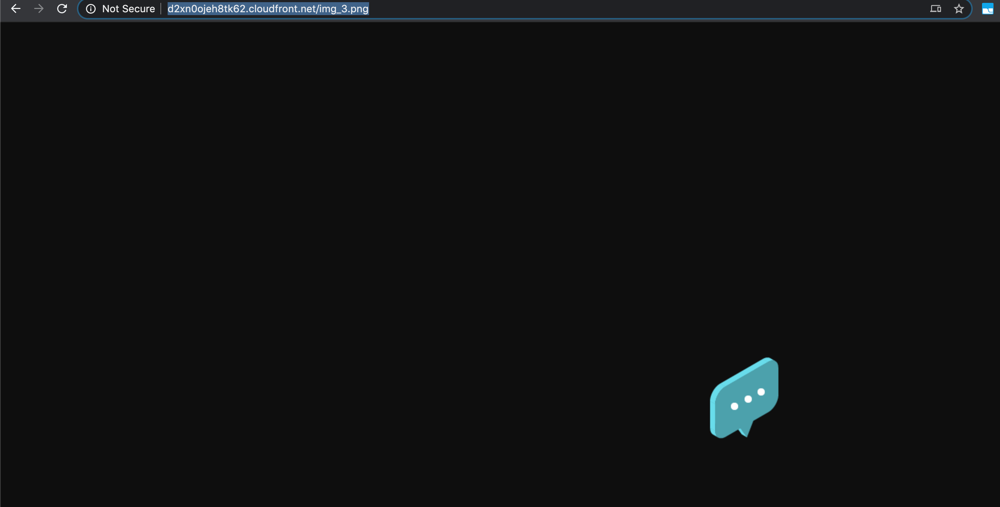

# Lottie Animation Manager :rocket:
The easiest way to manage, compress, and upload Lottie assets to a CDN



# Philosophy
Lottie Animation Manager was created to provide a new way of hosting and managing Lottie Animation Assets.  Instead of including all lottie animations inside of the `static` folder in an application, we think all animation assets should be hosted on a CDN (content delivery network).  

This way, updates to animation assets don't require changes to the code repository or static asset folder.  This also reduces the overall build size of an application, reducing the website load time for every user session.

Lottie Animation Manager is the first half of a larger plan.  Soon, there will be a companion Vue library as well which will let you easily reference your lottie assets hosted on a CDN from inside of your Vue Application.

# Features
- Upload your lottie animation assets to AWS S3 + Cloudfront CDN with a single command
- Automatically compress image assets using TinyPNG to save load time before they are uploaded

# Setup/Installation
Simply install the Lottie Animation Manager library through **pip**:
```bash
# most common way:
pip install lottie-animation-manager
# for people who have multiple versions of python:
pip3 install lottie-animation-manager
```
# Usage
1. Install the [AWS CLI](https://docs.aws.amazon.com/cli/latest/userguide/install-linux.html)
```
pip3 install awscli --upgrade --user
```
2. Configure / Add your AWS Security Access Keys by entering:
```
aws configure
```
3. Now, using `cd` , navigate to your folder with your lottie asset (which was exported by the Bodymovin plugin).  Your folder layout might look something like this:

5. Call the python application from your command line like so from inside this animation directory:
```
lottie-animation-manager
```
6. Once the application loads, follow the steps in the lottie animation wizard to upload, compress, and manage your assets to Cloudfront CDN :tada:

# AWS Cloudfront CDN Setup (Background)
Create an AWS Cloudfront deployment so that your lottie applications can load quickly worldwide whenever they are called within your application.
Basic instructions to do this:
1. Create your AWS security keys by visiting `Your account Name > My Security Credentials` at the top, clicking `Access Keys`, and clicking `Create New Access Key` .  Write down of these securities as you can only see them one time.
2. Create a basic [s3 bucket](https://s3.console.aws.amazon.com/s3/bucket/create):

image above is incorrect, disable block all public access
3. Uploaded an image asset and set it to read permission `everyone`

4. Visit [AWS Cloudfront](https://console.aws.amazon.com/cloudfront/home?#) home

5. Click `Create Distribution`
6. Click `Get Started` under **Web**

7. Enter an `origin domain name` where you are choosing your s3 bucket.  Keep all other default settings the same:

Click **Create Distribution**
8. Let cloudfront create your deployment, this takes a few minutes to complete.
9. Eventually you will see the status change to `Deployed` and state change to `Enabled`:

Note the domain name URL which cloudfront "creates" for your new deployment (ending in ****.cloudfront.net), you'll need this in the next step.
10. Visit your image asset with the new cloudfront endpoint URL to test to make sure your cloudfront CDN deployment is working.

# AWS Cost Warning
Please be careful using AWS services.  This includes costs you might accumulate for uploading files to services such as AWS S3.  

The Author/copyright holders of this package are not liable for any costs you might incur for cloud hosting or any other fees while using Lottie Animation Manager. 

# MIT License

Copyright (c) 2020 BAKZ T. FUTURE

Permission is hereby granted, free of charge, to any person obtaining a copy
of this software and associated documentation files (the "Software"), to deal
in the Software without restriction, including without limitation the rights
to use, copy, modify, merge, publish, distribute, sublicense, and/or sell
copies of the Software, and to permit persons to whom the Software is
furnished to do so, subject to the following conditions:

The above copyright notice and this permission notice shall be included in all
copies or substantial portions of the Software.

THE SOFTWARE IS PROVIDED "AS IS", WITHOUT WARRANTY OF ANY KIND, EXPRESS OR
IMPLIED, INCLUDING BUT NOT LIMITED TO THE WARRANTIES OF MERCHANTABILITY,
FITNESS FOR A PARTICULAR PURPOSE AND NONINFRINGEMENT. IN NO EVENT SHALL THE
AUTHORS OR COPYRIGHT HOLDERS BE LIABLE FOR ANY CLAIM, DAMAGES OR OTHER
LIABILITY, WHETHER IN AN ACTION OF CONTRACT, TORT OR OTHERWISE, ARISING FROM,
OUT OF OR IN CONNECTION WITH THE SOFTWARE OR THE USE OR OTHER DEALINGS IN THE
SOFTWARE.
